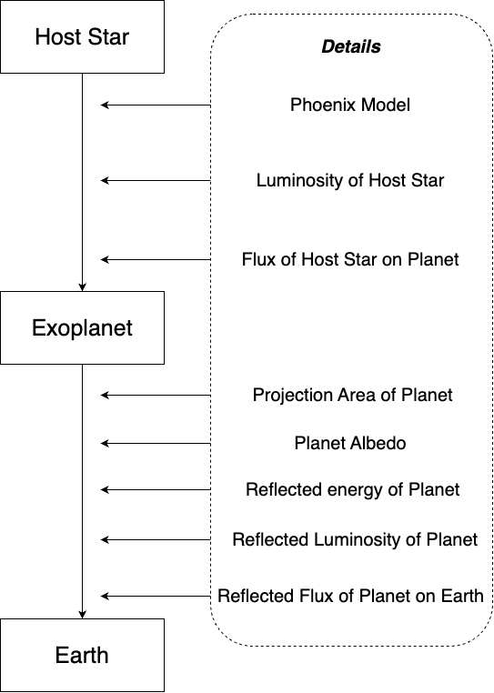

# reflected-light-sim
Calculates reflected light from a planet given a stellar PHOENIX model and planet albedo (developed as part of the 2023 CodeAstro workshop).\

## Installation Instructions
To install the package, run `pip install reflected-light-sim`.

## Simulation Flowchart

